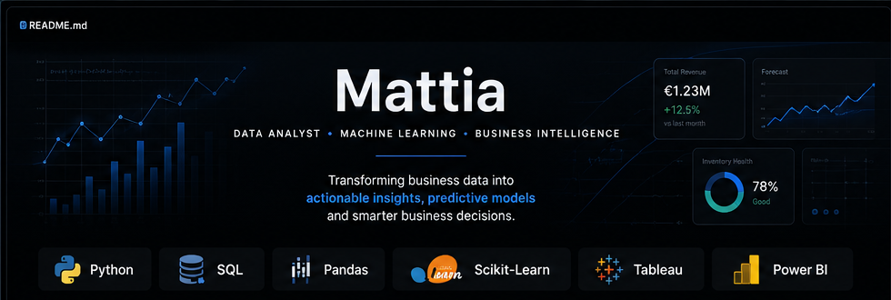
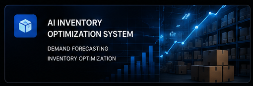
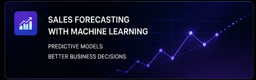
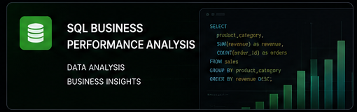
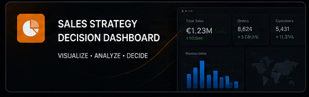

  

  
  
  
  
  
  

---

## About Me

I am a Data Analyst with over seven years of experience in e-commerce.

I help businesses transform sales, inventory and operational data into clearer forecasts, smarter replenishment decisions and actionable performance insights.

My work combines business understanding with Python, SQL, machine learning, predictive analytics, Tableau and Power BI.

---

## Featured Projects

<table>
<tr>
<td width="50%" valign="top">

<h3>AI Inventory Optimization System</h3>

End-to-end machine learning project for demand forecasting, inventory optimization and replenishment decisions.

<code>Python</code>
<code>Machine Learning</code>
<code>Forecasting</code>
<code>Inventory</code>

</td>
<td width="50%" valign="top">

<h3>E-commerce Operations Analytics Decision System</h3>

End-to-end analytics system designed to evaluate e-commerce operations, performance drivers and data-driven business decisions.

<code>Python</code>
<code>Pandas</code>
<code>Analytics</code>
<code>E-commerce</code>

</td>
</tr>

<tr>
<td width="50%" valign="top">

<h3>SQL Business Performance Analysis Dashboard</h3>

Business performance analysis focused on sales, customers, products and operational KPIs.

<code>SQL</code>
<code>Business Analysis</code>
<code>KPIs</code>
<code>Dashboard</code>

</td>
<td width="50%" valign="top">

<h3>Sales Strategy Decision Dashboard</h3>

Interactive dashboard designed to identify trends, performance drivers and business opportunities.

<code>Tableau</code>
<code>Data Analysis</code>
<code>Sales Strategy</code>
<code>Business Intelligence</code>

</td>
</tr>
</table>

---

## What I Do

- Demand forecasting and time-series analysis
- Inventory optimization and replenishment planning
- Sales, product and store performance analysis
- Data cleaning, validation and exploratory analysis
- Interactive Tableau and Power BI dashboards
- SQL analysis and business reporting

---

## My Approach

I do not build models simply to produce technical outputs.

I start by understanding the business problem, reviewing the available data and identifying the most relevant performance drivers.

I then create an analysis that supports practical business decisions.

---

## Current Focus

I am currently focused on developing advanced projects involving:

- Machine learning for retail and e-commerce
- Demand forecasting
- Inventory optimization
- Predictive and prescriptive analytics
- Business intelligence dashboards

---

  <strong>Turning data into better business decisions.</strong>

